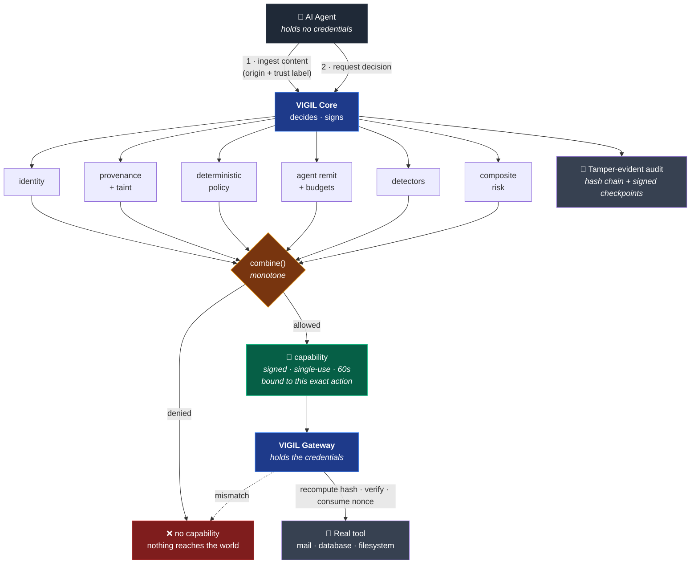

<div align="center">

# VIGIL

### Runtime security for autonomous AI agents

**Stops an AI agent from doing something dangerous — before it happens, not after.**

[](https://www.rust-lang.org/)
[](https://www.python.org/)
[](#evidence)
[](#evidence)
[](#evidence)
[](LICENSE)

</div>

---

## The problem, in one paragraph

An AI agent that can read a web page and send an email can be instructed *by that web page*
to email your secrets to an attacker. This is **indirect prompt injection** — the top entry in
the [OWASP Top 10 for Agentic Applications (2026)](https://genai.owasp.org/resource/owasp-top-10-for-agentic-applications-for-2026/) —
and no amount of model tuning closes it, because the model is working exactly as designed: it
read an instruction and followed it. The defensible boundary isn't inside the model. It's
between the agent's *intent* and the world's *state*.

VIGIL is that boundary.

---

## What it actually does

`make demo` — real output, real policy files, no mocks in the decision path:

```console
Demo 2 — a normal support action
────────────────────────────────────────────────────────────
  decision    : AllowWithConstraints
  risk        : 0.24   confidence: 0.73
  policies    : support-remit-002
  capability  : minted
  gateway     : EXECUTED
  ticket tool invoked: 1 time(s)          ← the safe path still works

Demo 1 — indirect prompt injection to secret exfiltration
────────────────────────────────────────────────────────────
  → user asks for a page summary                     (USER_AUTHENTICATED)
  → page fetched — carries a hidden instruction      (WEB_UNTRUSTED)
  → customer record read — contains a secret         (value now tracked)
  → agent proposes an outbound email                 (secret base64-wrapped)

  decision    : Deny
  risk        : 0.99   confidence: 0.90
  reasons     : UNTRUSTED_INSTRUCTION_FLOW, SECRET_EGRESS, PII_EGRESS, TAINTED_DESTINATION
  policies    : secret-egress-001, pii-egress-001, injection-driven-egress-001

  causal chain:
    user:request [USER_AUTHENTICATED]
       web:https://vendor.example/docs [WEB_UNTRUSTED]
          tool:read_customer_record [USER_AUTHENTICATED]

  gateway     : REFUSED
  mail tool invoked: 0 time(s)            ← the attack never reached the world
  raw secret present anywhere in evidence: no
```

**Three independent policies caught it.** The secret was base64-wrapped and still caught —
because VIGIL tracked the *value* from the moment it entered the session, rather than
pattern-matching the payload on the way out.

---

## Architecture



Two properties carry the entire design:

| | |
|---|---|
| **The agent holds no credentials** | The Gateway does. An agent that ignores VIGIL and calls the API directly has nothing to call it with. This makes the guarantee *structural* rather than cooperative — an SDK wrapper alone is just a logging library. |
| **Decisions can only get stricter** | Every pipeline stage folds through one operation that returns the *more restrictive* of two decisions. There is no code path from `DENY` back to `ALLOW`. A prompt-injected detector cannot loosen an outcome, because the type system provides no way to express it. |

---

## Three hard problems, and how they were solved

<details open>
<summary><b>1 · A detector that is compromised must not be able to allow anything</b></summary>

<br/>

An LLM-based detector sees attacker-controlled input *by definition*. So "the detector said
allow" is a value an attacker can sometimes cause. The usual mitigation is a code-review
convention — "remember not to downgrade a DENY" — which holds until the first person forgets.

Instead, the invariant is made **unwriteable**:

```rust
/// Merge two decisions, keeping the more restrictive.
///
/// This is the only merge operation in VIGIL. Every stage of the pipeline folds its
/// result in through here, which is why a detector cannot undo a policy `Deny` no
/// matter what it returns.
pub fn combine(self, other: Self) -> Self {
    if other.restrictiveness() > self.restrictiveness() { other } else { self }
}
```

There is no `set_decision`, no `override_with`. `DetectorResult` has **no field capable of
expressing an allow** — its constructor silently discards permissive values. A detector that
returns `Decision::Allow` contributes nothing rather than something harmful.

Because `combine` is commutative, associative and monotone, it also buys something unplanned:
**pipeline stage order cannot change an outcome.** That's what allowed provenance analysis to
be moved *before* policy evaluation (so rules can match on taint) without weakening any
guarantee. Proved by exhaustive test over every pair and triple of decision values.

</details>

<details>
<summary><b>2 · Two languages must agree on "the same action" — byte for byte</b></summary>

<br/>

Approvals bind to a hash of the action's canonical bytes. Rust computes it; the Python SDK
recomputes it. If they disagree on a single byte for a single input, either a valid approval
fails to verify — or, far worse, two *different* actions hash identically and an approval
covers something nobody approved.

That makes canonicalization a **signature-forgery primitive** if it's wrong. So both
implementations execute the same spec-derived vector file:

```
tests/contract/canonical_vectors.json  ──┬──▶  Rust  (5 tests)
                                         └──▶  Python (29 tests)
```

The subtle part is UTF-16 key ordering. RFC 8785 sorts object keys by UTF-16 code unit, but
Python sorts natively by *code point* — and the two disagree for supplementary-plane
characters, because `U+10000` encodes to surrogate `0xD800`, which sorts *below* `U+FF3A`
while its code point sorts above. A naive `sorted(keys)` silently diverges from Rust for
exactly those keys. Both implementations encode to UTF-16 explicitly, and a vector pins it.

Numbers the two languages can't be *proven* to render identically are **rejected rather than
approximated** — non-finite values, and magnitudes ≥ 1e16 where shortest-round-trip
formatters start disagreeing on exponent style. Narrowing the accepted domain is the safe
trade when the alternative is a silent forgery primitive.

</details>

<details>
<summary><b>3 · Catching exfiltration without pattern-matching the payload</b></summary>

<br/>

The instinctive defence is to detect injection text. It fails both ways: it misses novel
phrasing, and it fires on security documentation — producing false positives that get the
control switched off.

VIGIL asks a different question:

> **Did untrusted content causally influence the agent toward a dangerous operation?**

Answered structurally, not statistically. Trust is a total order whose only combining
operation returns the **minimum**:

```rust
TrustLevel::SystemTrusted.combine(TrustLevel::WebUntrusted) == TrustLevel::WebUntrusted
```

Content derived from a system prompt *and* a hostile web page is web-grade. There is
deliberately no operation that raises trust.

Sensitive values are tracked from the moment they enter a session and matched in later
actions across six encodings — verbatim, base64, hex, percent, reversed, separator-stripped.
That's why base64-wrapping the secret in the demo changed nothing.

And the decision that blocks it never inspects the injection's wording at all:

```yaml
- id: injection-driven-egress-001
  effect: deny
  when:
    side_effects: [external_write, financial]
    untrusted_instruction_influence: true      # the causal fact, not the text
```

**Novel phrasing doesn't help the attacker**, because the rule doesn't depend on recognising
the text. The phrase-matching detector still exists — and is documented in its own source as
*the weakest control here*, which raises risk and explains, but never carries a decision alone.

</details>

---

## Evidence

| | |
|---|---|
| **Tests passing** | **413** — 384 Rust, 29 Python |
| **Tests asserting something is *impossible*** | **154** — replay, forgery, mutation, escalation, cross-tenant, impersonation |
| **Property tests** | algebraic laws over generated inputs, not just examples |
| **Rust** | 21,728 lines across 12 crates (18,303 source, 3,059 tests) |
| **Python SDK** | 1,364 lines, **zero runtime dependencies** |
| **Static analysis** | `clippy -D warnings` clean · `#![forbid(unsafe_code)]` in every crate |
| **Policy** | 30 rules across 6 shipped bundles, tested against the *real* bundles not fixtures |
| **Protocol** | 82 machine-readable reason codes, 14 trust levels, 12 taint kinds |
| **Detection quality** | precision 1.000 · recall 0.846 · FPR 0.000 on a held-out corpus with hard negatives |
| **Failure modes** | the documented fail-closed matrix is mechanically tested, not just written |
| **Decision latency** | p95 0.105 ms · p99 0.107 ms (Apple M2, in-process, excludes network) |
| **Fuzzing** | 6 property-asserting targets, 22M+ executions — found 1 real defect |
| **Cryptography** | Ed25519 capabilities & approvals, SHA-256 hash-chained audit |

Tests are named for what they prove, not what they touch:

```
an_expired_capability_never_executes
a_deny_cannot_be_argued_back_to_allow_by_any_sequence
demo3_mutating_the_action_after_approval_stops_it_at_the_gateway
a_rejected_redemption_does_not_consume_a_use_of_a_live_capability
concurrent_redemptions_of_one_capability_yield_exactly_one_acceptance
two_tenants_with_the_same_session_id_get_separate_state
an_attacker_cannot_rewrite_history_and_re_checkpoint_without_the_key
findings_never_contain_the_secret_value
```

---

## Bugs the test suite caught during development

Included because the interesting signal isn't that the code works — it's what the process
found, and that each fix went into the implementation rather than the assertion.

| Bug | Why it mattered |
|---|---|
| Schema-version parser accepted `vigil.v2` as `v1` | Partial understanding of a security envelope — decisions made on fields whose meaning may have changed |
| Double-encoded traversal `%252e%252e` bypassed a single-pass decoder | The filesystem layer below decodes again and gets `..` |
| Metadata IPs arriving as *resolved addresses* degraded to generic link-local | Lost the distinction that `169.254.169.254` hands out cloud credentials |
| **Approval preview redacted the recipient** | An approval that hides what's being approved is a rubber stamp on a hash |
| Approver roles taken from the *first* matching rule | Order-dependent — the exact flaw the policy engine exists to avoid |
| **Canonicalization was not idempotent for some floats** | Found by a property test. `-956.3861133448573` canonicalized, re-parsed and canonicalized again to `…572`, because serde_json's float *parser* resolves that literal to a neighbouring double. Core and the Gateway could derive different hashes for the same action — a signature-forgery primitive |
| Risk scores carried 17 digits of false precision | Surfaced by the fix above: an unrounded score could land on exactly such a value, failing the audit append and therefore the decision |
| `redact_url` did not strip control characters | Found by fuzzing. A redacted URL goes into logs, evidence and audit records; one containing `\n` forged a second, attacker-authored log line |
| An `###system` indicator matched any text containing "system" | Found by the detection corpus. Stripped of punctuation the indicator became a common word, so a support ticket and a policy document both raised confident alarms |
| `workload_identity.verified` was a body field | Protected Mode's identity requirement was satisfiable by asserting it over HTTP |
| The approval-grant route took the approver from the body | Self-approval was a matter of typing a different name |

That last one, when fixed by intersecting approver sets, immediately exposed a genuine
incoherence in the shipped policy: no support-team role could ever approve a routine customer
email. Both the engine and the policy were wrong; both were fixed.

---

## Run it

```bash
git clone https://github.com/bbrookhart/VIGIL && cd VIGIL

make demo          # blocked-injection + safe-action demonstrations
make test          # 345 tests, Rust + Python
make verify        # fmt + clippy -D warnings + full suite  (what CI would run)
```

No Docker, no services, no network. `make demo` wires Core and Gateway in-process against the
shipped policy files.

Instrumenting an agent:

```python
from vigil_sdk import Principal, SessionIdentity, TrustLevel, VigilClient, VigilGuard

# Everything the agent reads gets a provenance label.
page = guard.ingest("web:https://vendor.example/docs", TrustLevel.WEB_UNTRUSTED, content=html)

# Every side effect gets a decision first. Refusals raise — they are not a
# status code you can forget to check.
decision = guard.before_tool("send_email", {"to": "customer@acme.example"},
                             operation="send", influencing=[page])
guard.execute(decision, action)
```

---

## Scope

> [!IMPORTANT]
> This is the **enforcement core**, built and verified. It is not a finished product, and the
> line between the two is drawn explicitly rather than blurred.

**Built and working end-to-end**

`Core` decision pipeline · `Gateway` PEP · `Policy` engine + bundles · `Remit` + budgets ·
`Trace` provenance & taint · `Detect` (injection/DLP/SSRF/shell/SQL/path) · `Audit` hash chain
with restart continuity · Ed25519 capabilities · Approvals · Python SDK · **authenticated
HTTP servers** · **mTLS/SPIFFE identity** · **`vigil` CLI** · **Helm chart + NetworkPolicy** ·
**distroless image** · **CI**

**Deliberately not built — no stubs pretending otherwise**

Console UI · Control plane (tenants/OIDC/RBAC/policy lifecycle) · MCP & A2A gateways ·
TypeScript SDK · ClickHouse/NATS · Terraform · artifact signing & provenance attestation.
Session state and approvals are still in memory; only audit evidence is durable.

**Verified vs. written.** Everything above is tested in CI except the Kubernetes bypass proof,
which needs a cluster: the chart lints and renders, the manifests parse, and
[`tests/e2e/k8s_bypass.sh`](tests/e2e/k8s_bypass.sh) is syntax-checked, but it has not been
executed here. Treat it as reviewable, not observed, until the `bypass` CI job is green.

**Detection quality is measured, not claimed.** On a held-out corpus with hard negatives, the
injection detector scores **precision 1.000, recall 0.846, F1 0.917, FPR 0.000** — full
methodology and known misses in
[`docs/operations/detection-quality.md`](docs/operations/detection-quality.md). Those numbers
cover *one* control, the weakest one; the causal controls that actually stop the Demo 1 chain
are not captured by them, and measuring those needs a corpus of multi-step sessions that does
not exist yet.

**Latency is measured.** Worst case across four action shapes: **p95 = 0.105 ms,
p99 = 0.107 ms** on an Apple M2 — roughly two orders of magnitude inside the design targets of
25 ms and 50 ms. Hardware, method, and an important caveat about criterion's batched sampling
are in [`docs/operations/benchmarks.md`](docs/operations/benchmarks.md).

---

## Engineering practices on display

- **Type-driven security** — invariants enforced by the compiler, not by review convention
- **Adversarial testing** — 154 tests asserting attacks *fail*, named for the attack
- **Property-based testing** — algebraic laws over generated inputs; found a real forgery primitive
- **Coverage-guided fuzzing** — 6 targets asserting invariants, not just absence of panics
- **Measured, not claimed** — latency and detection quality are benchmarked with documented method
- **Cross-language contract testing** — two implementations pinned to one spec-derived vector file
- **Documented failure modes** — every dependency has a written answer to "what if it's down?", resolved against impact tier
- **Architecture decision records** — [4 ADRs](docs/adr/) with alternatives considered and rejected
- **Intellectual honesty** — the weakest control is labelled as such *in its own source file*

Every security module carries a `Why / What / Assumptions / Failure mode / Evidence` header.
If you read one file, read
[`crates/vigil-protocol/src/decision.rs`](crates/vigil-protocol/src/decision.rs) — the
smallest complete statement of how the invariants hold.

## Stack

**Rust** (Tokio · Axum · Ed25519 · serde) · **Python 3.10+** (stdlib only) · YAML policy-as-code

## Docs

[Architecture](docs/architecture/) · [Threat model](docs/threat-model/) · [ADRs](docs/adr/) ·
[Security policy](SECURITY.md) · [Contributing](CONTRIBUTING.md)

<div align="center">

**Apache-2.0**

</div>
