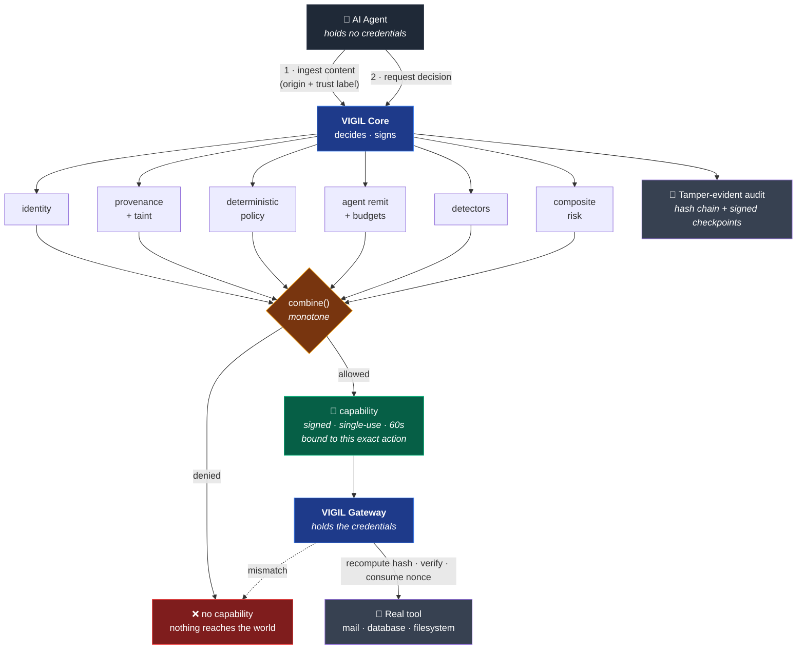

<div align="center">


<br/>

[](https://www.rust-lang.org/)
[](https://swift.org/)
[](#evidence)
[](#evidence)
[](LICENSE)

<br/>

**An agent asks. VIGIL decides. Only then does anything reach the world.**

[Why VIGIL](#the-problem-in-one-paragraph) · [Architecture](#architecture) · [Evidence](#evidence) · [Run it](#run-it) · [Security](SECURITY.md)

<br/>

<table>
<tr>
<td align="center"><b>734</b><br/><sub>Rust tests</sub></td>
<td align="center"><b>107</b><br/><sub>Swift tests</sub></td>
<td align="center"><b>25</b><br/><sub>attack scenarios</sub></td>
<td align="center"><b>12</b><br/><sub>fuzz targets</sub></td>
<td align="center"><b>45</b><br/><sub>decision records</sub></td>
<td align="center"><b>0</b><br/><sub>lines of unsafe</sub></td>
</tr>
</table>

<br/>

</div>

> **The one-sentence version.** An AI agent that reads a web page can be instructed *by that
> web page* to email your secrets to an attacker. No amount of model tuning closes this, because
> the model is working exactly as designed. VIGIL moves the boundary out of the model and puts it
> between the agent's *intent* and the world's *state*.

<div align="center">

```
     ┌─────────┐        ┌──────────────────┐        ┌──────────────┐
     │  AGENT  │───────▶│      VIGIL       │───────▶│  REAL WORLD  │
     │         │  asks  │  decides · signs │  only  │  files · net │
     │ holds   │        │  records · bounds│  if    │  secrets     │
     │ nothing │◀───────│                  │  allowed              │
     └─────────┘ refuse └──────────────────┘        └──────────────┘
                              │
                              ▼
                    tamper-evident record
                    of every decision made
```

</div>

---

## The problem, in one paragraph

An AI agent that can read a web page and send an email can be instructed *by that web page*
to email your secrets to an attacker. This is **indirect prompt injection** — the top entry in
the [OWASP Top 10 for Agentic Applications (2026)](https://genai.owasp.org/resource/owasp-top-10-for-agentic-applications-for-2026/) —
and no amount of model tuning closes it, because the model is working exactly as designed: it
read an instruction and followed it. The defensible boundary isn't inside the model. It's
between the agent's *intent* and the world's *state*.

VIGIL is that boundary.

---

## Local macOS control plane

VIGIL is expanding from its portable decision/gateway core into a local macOS runtime control
plane. The first entitlement-independent vertical slice is now available:

```console
# Inspect the truthful protection posture.
cargo run -p vigil-cli -- status

# Launch a durable local agent session (currently OBSERVE ONLY at the OS boundary).
cargo run -p vigil-cli -- --state-db /tmp/vigil.db run \
  --profile developer-standard --workspace "$PWD" -- /usr/bin/true

# Create a reusable semantic-enforcement session.
cargo run -p vigil-cli -- --state-db /tmp/vigil.db session start \
  --profile developer-standard --workspace "$PWD"

# Perform broker-mediated I/O using the returned session ID.
printf 'managed content' | cargo run -p vigil-cli -- --state-db /tmp/vigil.db \
  fs write ags_... output.txt
cargo run -p vigil-cli -- --state-db /tmp/vigil.db \
  fs read ags_... output.txt > /tmp/output.txt
# Delete, rename, and list are mediated too, with preimages so `vigil rollback` undoes them.
cargo run -p vigil-cli -- --state-db /tmp/vigil.db fs delete ags_... output.txt
cargo run -p vigil-cli -- --state-db /tmp/vigil.db fs rename ags_... old.txt new.txt
cargo run -p vigil-cli -- --state-db /tmp/vigil.db fs list ags_... .

# Execute a structured, side-effect-free utility with no shell or PATH lookup.
cargo run -p vigil-cli -- --state-db /tmp/vigil.db \
  process exec ags_... --program /bin/echo -- 'brokered process output' \
  > /tmp/process-output.txt

# Resolve, validate, connect, and immediately close without sending application data.
cargo run -p vigil-cli -- --state-db /tmp/vigil.db \
  network probe ags_... --host github.com --port 443
cargo run -p vigil-cli -- --state-db /tmp/vigil.db session budget ags_...

# A capability the profile will not grant on its own raises an approval request, not a
# dead end. Granting it mints one lease bound to exactly this action and resolved resource.
cargo run -p vigil-cli -- --state-db /tmp/vigil.db \
  process exec ags_... --program /usr/bin/uname --discard-output   # REQUIRE_APPROVAL
cargo run -p vigil-cli -- --state-db /tmp/vigil.db approvals show apr_...
cargo run -p vigil-cli -- --state-db /tmp/vigil.db \
  approvals grant apr_... --approver operator --max-uses 1

# Inspect what the session holds, why its risk is where it is, and what it launched.
cargo run -p vigil-cli -- --state-db /tmp/vigil.db capabilities ags_...
cargo run -p vigil-cli -- --state-db /tmp/vigil.db risk ags_...
cargo run -p vigil-cli -- --state-db /tmp/vigil.db processes ags_...
cargo run -p vigil-cli -- --state-db /tmp/vigil.db events ags_...

# Detections, incidents, containment, and evidence.
cargo run -p vigil-cli -- --state-db /tmp/vigil.db detections --session ags_...
cargo run -p vigil-cli -- --state-db /tmp/vigil.db incidents list
cargo run -p vigil-cli -- --state-db /tmp/vigil.db incidents show inc_...
cargo run -p vigil-cli -- --state-db /tmp/vigil.db contain ags_... --seal
cargo run -p vigil-cli -- --state-db /tmp/vigil.db incidents export inc_...

# Recompute the event chain. Editing or deleting a record fails this, non-zero.
cargo run -p vigil-cli -- --state-db /tmp/vigil.db audit verify-local

# MCP is authorized by its arguments, not by what the tool calls itself.
cargo run -p vigil-cli -- --state-db /tmp/vigil.db mcp register \
  --name filesystem --transport stdio --executable /path/to/server
cargo run -p vigil-cli -- --state-db /tmp/vigil.db mcp sync filesystem --manifest tools.json
cargo run -p vigil-cli -- --state-db /tmp/vigil.db mcp authorize ags_... \
  --server filesystem --tool write_file --arguments '{"path":"~/.ssh/config"}'   # DENY

# Compare what the session declared against what an OS observer saw. With nothing
# watching this reports NO_OBSERVER and exits non-zero — never "consistent".
cargo run -p vigil-cli -- --state-db /tmp/vigil.db reconcile ags_... --observed observed.json

# Undo the session's broker-mediated writes. Refuses any file something else changed.
cargo run -p vigil-cli -- --state-db /tmp/vigil.db rollback ags_... --dry-run
cargo run -p vigil-cli -- --state-db /tmp/vigil.db rollback ags_...

# Place bait that exists only to be touched. Workspace only, never a real credential path.
cargo run -p vigil-cli -- --state-db /tmp/vigil.db canary place ags_... --kind cloud-credentials

# Git, with the repository's own configuration neutralized so it cannot run programs.
cargo run -p vigil-cli -- --state-db /tmp/vigil.db git status ags_...
cargo run -p vigil-cli -- --state-db /tmp/vigil.db git commit ags_... --message "fix"
cargo run -p vigil-cli -- --state-db /tmp/vigil.db git push ags_... --branch main  # approval

# Analyze stored evidence for shapes that need more than one event to see.
cargo run -p vigil-cli -- --state-db /tmp/vigil.db analyze ags_...

# Stand between an agent and an MCP server. A refused call never reaches the server.
cargo run -p vigil-cli -- --state-db /tmp/vigil.db mcp proxy ags_... \
  --server filesystem -- /path/to/server

# Evaluate a workspace capability without executing it.
cargo run -p vigil-cli -- policy evaluate \
  --profile developer-standard --workspace "$PWD" \
  --action fs.read --resource ~/.ssh/id_ed25519

# Persist the same request as replayable simulation evidence.
cargo run -p vigil-cli -- --state-db /tmp/vigil.db simulate \
  --profile developer-standard --workspace "$PWD" \
  --action fs.read --resource ~/.ssh/id_ed25519
```

This slice provides high-entropy session identity, process launch lifecycle, SQLite/WAL
persistence, a normalized event timeline, profile validation, symlink-aware workspace checks,
default deny, protected-resource denial, transactional blast-radius reservations, atomic managed
writes, a structured process broker with a cleared environment and bounded output/timeout, a
payload-free network probe broker with destination-integrity checks and unique-destination
accounting, a no-disclosure secret-broker interface and deterministic provider simulator,
content-free broker evidence, and human/JSON CLI output.

It also closes the authority loop. An approval binds `sha256(session, action, resolved resource)`;
granting one mints exactly one capability lease over that same triple, so the operator decides
*whether*, never *what*. Leases expire by SQL predicate rather than by a status column — an expired
lease is inert with no sweeper having run — are use-counted by a single atomic statement, and carry
a `CHECK(delegable = 0)` that makes non-delegability a property of the database. A lease can raise
`REQUIRE_APPROVAL` to `ALLOW`; it can never touch a `DENY`.

Session risk is twelve named dimensions and a documented threshold function over them, not one
opaque score, and it only ever subtracts authority. Repeating a request a human already refused
loads the policy-evasion dimension until the capability is withheld outright, at which point the
agent stops reaching the operator at all — approval fatigue is treated as an attack on the human
rather than as noise. Reaching a containing state revokes outstanding leases in the same
transaction that records the transition. Every process VIGIL launches becomes a graph node with an
opaque identity; a partial unique index over live PIDs means a recycled PID becomes a separate node
instead of inheriting one. See [ADR 0017](docs/adr/0017-approvals-mint-bounded-capability-leases.md),
[ADR 0018](docs/adr/0018-risk-is-monotone-and-only-subtracts-authority.md), and the
[fail-closed matrix](docs/security/FAIL_CLOSED_MATRIX.md).

Denials that name a detection produce one, from a fixed catalogue of 36 rules carrying a
severity and a *separate* confidence, plus the Agentic Runtime Security Tactic they belong to.
Rules are constants, not a scripting surface. A critical detection — or a session reaching a
containing risk state — opens an incident; responses are named, idempotent, and recorded even
when they changed nothing. The event log is hash-chained over canonical bytes, so editing a
record, deleting one, or reordering two all fail `vigil audit verify-local` with a non-zero exit.
The hash chain alone cannot expose a wholesale rewrite, so manual Ed25519 checkpoints bind a
sequence and head hash to a key outside the database. An attacker who can also obtain that signing
key can still rewrite and re-sign history; this is tamper evidence, not immutability. See
[ADR 0019](docs/adr/0019-local-detections-incidents-and-a-tamper-evident-event-chain.md) and
[ADR 0040](docs/adr/0040-signed-checkpoints-close-the-rewrite-hole.md).

MCP is treated as a first-class attack surface. A tool name is a string the server chooses, so
mapping names to capabilities would fail against the threat it is meant to cover; instead every
path-like and URL-like argument is extracted and authorized independently through the same path a
direct broker request takes. One refusal refuses the call. Declared capabilities are compared but
never grant — a tool declaring everything is still refused when it reaches for a credential.
Unregistered servers, unknown tools, resource-free calls, and reaches beyond a tool's declaration
fail closed rather than being permitted by an empty or incomplete resource fold.
Multi-resource calls preflight first and consume all required leases in one transaction, so a
later refusal cannot partially burn authority granted to an earlier resource.
Server identity is the name plus the SHA-256 of its binary, so swapping the program behind a
trusted name is detectable and quarantines the session on its own. Trusted registration currently
accepts only local stdio servers with an exact executable path and VIGIL-observed digest; HTTP and
unknown transports remain refused until they have an authenticated endpoint identity model.
Drifted observations never overwrite the trusted tool baseline. See
[ADR 0020](docs/adr/0020-mcp-calls-are-authorized-by-their-arguments.md).

Intent–execution reconciliation compares what a session *declared* against what an OS observer
*saw*. Five classes separate an incomplete view from a defeated one: `DENIED_OPERATION_OBSERVED`
means VIGIL refused an operation and it happened anyway — the broker was bypassed — and
quarantines the session on its own. The decision that keeps this honest is what an empty result
means: with no extension installed, no observations means nothing was watching, so an unobserved
session is never reported as consistent and `vigil reconcile` exits non-zero. See
[ADR 0024](docs/adr/0024-intent-execution-reconciliation.md).

Managed writes are reversible. The broker records the prior content, addressed by hash, and the
postimage it leaves behind; `vigil rollback` restores them newest-first. It refuses any file that
changed after VIGIL wrote it — restoring would discard a change VIGIL did not make — and verifies
a stored blob against its own digest before writing it back. Coverage is exactly as wide as broker
coverage and every report says so, because observing a write never recovers what preceded it.

Deception places synthetic assets that exist only to be touched, **only** inside the workspace and
never in a real credential location. The detection fires on an *allowed* read, since a canary is
an ordinary workspace file, and is rated CRITICAL severity with MEDIUM confidence — a recursive
search can sweep a workspace, and a detection nobody believes is worse than none. See
[ADR 0025](docs/adr/0025-broker-mediated-rollback-and-workspace-only-deception.md).

Git gets its own broker, because Git configuration executes programs — `core.pager`,
`credential.helper`, `filter.*.clean`, every `alias.*`, and hooks all run commands, and an agent
that can write files can write `.git/config`. In a repository it controls, a plain `git status` is
a code-execution primitive. Every invocation is built with `-c` overrides applied unconditionally
(inspecting first would race the file), hooks redirected to an empty directory, and ambient config
removed. A live test rigs a repository and runs five operations without the payload firing, with a
control proving the same payload fires when Git is invoked naively. Force-push is denied in every
enforcing profile; a push is approval-bound and its remote host goes through network policy. See
[ADR 0026](docs/adr/0026-git-configuration-is-a-code-execution-surface.md).

Some shapes only exist across time: reading credentials and *then* opening a connection,
archiving before egress, a chain of interpreters, a burst of processes. Each step is individually
unremarkable and individually decided, so a decision-time rule cannot see them. `vigil analyze`
runs sequence, threshold, and graph rules over the durable event log and process graph — and is
explicit that this is retrospective: it explains what a session turned out to be doing rather than
stopping it. Ordering and proximity are load-bearing (egress *before* a credential read is not
exfiltration), fan-out is a rate rather than a total, and a cascade is lineage rather than
adjacency. See [ADR 0028](docs/adr/0028-sequence-threshold-and-graph-detections.md).

Local IPC is treated as part of the credential surface. Protecting `~/.ssh/id_ed25519` is not
enough if the SSH agent socket lets a caller use those keys without reading a file, and a container
socket is root-equivalent without any privileged executable or `sudo`. Both are denied in every
enforcing profile and contain the session on a single occurrence. The protected registry is checked
against the named path as well as the resolved one, so probing for a socket that is absent still
fires — the attempt is the signal.

Expiry does not trust the system clock. Leases and approvals compare against
`max(wall clock, monotone high water)`, so turning the clock back cannot resurrect expired
authority — the adversarial harness grants a one-second lease, expires it, moves time backwards,
and asserts the call is still refused *with uses remaining*, so the refusal is about time rather
than exhaustion. See [ADR 0030](docs/adr/0030-effective-time-only-moves-forward.md).

A path is not an identity. The filesystem broker captures device and inode before opening and
compares them against the open file handle, so a symlink dropped in place between the decision and
the open is refused rather than returning content policy never approved — with the event still
recording the approved path, which would have made the evidence wrong too. Writes recheck the
parent directory the same way before the rename. This narrows the race to stat-to-open and makes it
detectable; eliminating decide-to-open needs `openat` and therefore `unsafe`. See
[ADR 0031](docs/adr/0031-a-path-is-not-an-identity.md).

An executable path is not an executable either. The process broker takes the binary's device,
inode, and content hash at validation, re-checks the identity immediately before spawning, and
records the hash in the provenance graph — which had carried an `executable_sha256` field since it
was built and always written `None`, so the graph recorded paths but never what actually ran. See
[ADR 0032](docs/adr/0032-an-executable-path-is-not-an-executable.md).

Containment outlives the session. Risk and budgets are per-session, which made shedding
containment as easy as starting again — a quarantined agent could open a new session on the same
workspace and immediately write freely. A session created on a workspace contained within the last
hour now starts `ELEVATED`: mutations need a human, reads still work, and unrelated workspaces are
untouched. See [ADR 0033](docs/adr/0033-containment-outlives-the-session.md).

Budgets are per-session, which makes the cumulative total unbounded for anyone who can start
sessions — three sessions on one workspace were measured performing 75 writes against a 25-write
limit. The per-task model is deliberate, so the control notices the pattern rather than changing
it: cycling sessions on a workspace fires `VIGIL-L035` carrying the summed consumption, and raises
the new session to `ELEVATED`. See
[ADR 0037](docs/adr/0037-session-churn-multiplies-blast-radius.md).

The filesystem capability surface is now complete. `fs.delete`, `fs.rename`, and `fs.list` had
policy decisions and budget dimensions from the start with no broker behind them — a capability
with no broker is not a control, and `file_deletes` counted an operation that could not occur. A
rename is recorded as the two effects it actually is (the destination gains content, the source
becomes absent), so rollback restores an *overwritten* destination rather than only moving the file
back. Listing is mediated even though it changes nothing, because enumerating toward a protected
location is a signal VIGIL previously could not see. See
[ADR 0038](docs/adr/0038-the-filesystem-capability-surface-is-complete.md).

The Phase 3 foundation is also present: `vigil-endpoint` provides an audit-token keyed,
deadline-safe authorization fast path and deterministic Endpoint Security simulator. A native
Swift adapter compiles against the public macOS SDK for `AUTH_EXEC`, `AUTH_OPEN`, `AUTH_CREATE`,
`AUTH_RENAME`, `AUTH_UNLINK`, fork, and exit. It uses the correct per-event response APIs,
disables decision caching, and includes a bounded versioned Swift policy/attribution state. It is
fed only by an instance-bound, expiring Ed25519-signed snapshot that Rust and Swift verify against
one shared fixture. The native control layer also compiles a strict install/bind/health protocol and
verifies XPC senders from their kernel-attached audit token and code requirement. It is not an
installed daemon, registered Mach service, or entitled OS enforcement boundary. A bounded native
listener lifecycle compiles and a real anonymous-XPC check exercises successful kernel-associated
peer authentication. Per-peer idle timers prevent connection-slot exhaustion and refresh only
after code-identity authentication; wrong-identity peers are rejected and disconnected. The
matching native client bounds every request/reply wait, caps outstanding work, and invalidates
the channel on timeout with an explicit outcome-unknown error so mutations are not blindly replayed.
The extension-side control service durably commits a strict generation high-water mark before
activating or acknowledging policy, preventing signed-snapshot rollback across restart.
Its authenticated health response also exposes bounded native callback latency, deadline pressure,
response failures, and sequence-loss counters without performing callback I/O.
Signed policy expiry is enforced as an exclusive runtime lease: managed authorization fails closed
after expiry or clock failure, while unrelated host processes remain unaffected.
The same authenticated protocol can register a managed root using its complete audit token bound
to the installed policy generation; PID claims and conflicting token reassignment are rejected.

The Phase 4 foundation now has the corresponding network boundary. `vigil-network` signs compact,
instance-bound destination snapshots, and a public `NEFilterDataProvider` subclass verifies and
installs them before projecting audit-token-attributed flows into a no-I/O callback state. Exact
hostname, protocol, port, pinned public address, resolution lease, whole-policy lease, and flow/
destination budgets are enforced consistently by Rust and Swift checks. The protected publisher,
read-only provider startup lifecycle, and matching containing-app configuration factory are built,
and the unsigned containing app embeds the provider as a real System Extension product. It is not
provisioned, signed, or activatable, so this does not intercept direct sockets yet.
See [ADR 0035](docs/adr/0035-network-flow-authority-is-hostname-plus-pinned-address.md),
[ADR 0036](docs/adr/0036-macos-network-policy-arrives-out-of-band.md), and the
[Network Extension model](docs/architecture/NETWORK_EXTENSION_MODEL.md).

> [!IMPORTANT]
> **VIGIL reports `OBSERVE ONLY` at the OS boundary, and means it.**
> Every control below is enforced for operations that pass *through* VIGIL. None of them can
> stop a process that ignores VIGIL and calls the kernel directly. That needs an entitled
> System Extension, which Apple must grant and has not.

<div align="center">

### What is enforced, and what is not

</div>

| Control | Status | What that actually means |
|:--|:--|:--|
| **Policy decisions** | 🟢 Enforced | Monotone, order-independent, deterministic. No path from `DENY` to `ALLOW`. |
| **Capability leases** | 🟢 Enforced | TTL-bounded, use-counted, non-delegable by database constraint. Expiry is a SQL predicate, so it needs no cleanup job. |
| **Blast-radius budgets** | 🟢 Enforced | Reserved and committed in one `BEGIN IMMEDIATE` transaction; the arithmetic is constrained by the database, not the caller. |
| **Filesystem / process / git brokers** | 🟢 Enforced | Device+inode identity, no shell, no `PATH` lookup, repository config neutralised. |
| **Audit chain** | 🟢 Enforced | Hash-chained, plus signed checkpoints that detect a *wholesale rewrite*, not merely an edit. |
| **Process termination** | 🟡 Bounded | `vigil contain --terminate` stops the recorded tree, verifying `(pid, start time, command)` before each signal. Identity rests on a one-second-granularity clock: evidence, not proof. |
| **Secret use** | 🟡 Bounded | Real Keychain credentials reach `git` without entering `argv`, VIGIL's files, or the event log. HTTP auth and artifact signing are not implemented and fail rather than claiming a use. |
| **Network** | 🟡 Bounded | Destination policy is enforced for flows routed through the broker. The probe sends no payload. A direct socket is unmediated. |
| **MCP** | 🟡 Bounded | Traffic through `vigil mcp proxy` is authorized by its *arguments*. An agent that contacts a server directly is not mediated. |
| **Sandboxing the child** | 🔴 Not enforced | `vigil run` does not confine its child. It keeps the launching user's full ambient authority. |
| **No self-authorization** | 🔴 Not enforced | No broker *can* reach the grant path — the type it needs cannot be built from broker code, and a test asserts it. But with no `vigild`, an agent runs as the same user and can invoke the CLI itself. **Invariant 3 is not satisfied at the OS level.** |
| **Reconciliation** | 🔴 No observer | The engine compares two records; nothing produces the second one. Every reconciliation on a real session reports `NO_OBSERVER` and exits non-zero — never "consistent". |

<sub>🟢 enforced for brokered operations · 🟡 real but bounded, limits stated · 🔴 needs the entitled half</sub>

See the [local architecture](docs/architecture/ARCHITECTURE.md),
[Endpoint Security model](docs/architecture/ENDPOINT_SECURITY_MODEL.md),
[Endpoint policy transport](docs/architecture/ENDPOINT_POLICY_TRANSPORT.md),
[trust boundaries](docs/security/TRUST_BOUNDARIES.md), and
[Apple entitlement status](docs/development/APPLE_ENTITLEMENTS.md).

---

## What it actually does

`make demo` — real output, real policy files, no mocks in the decision path:

```console
Demo 2 — a normal support action
────────────────────────────────────────────────────────────
  decision    : AllowWithConstraints
  risk        : 0.24   confidence: 0.73
  policies    : support-remit-002
  capability  : minted
  gateway     : EXECUTED
  ticket tool invoked: 1 time(s)          ← the safe path still works

Demo 1 — indirect prompt injection to secret exfiltration
────────────────────────────────────────────────────────────
  → user asks for a page summary                     (USER_AUTHENTICATED)
  → page fetched — carries a hidden instruction      (WEB_UNTRUSTED)
  → customer record read — contains a secret         (value now tracked)
  → agent proposes an outbound email                 (secret base64-wrapped)

  decision    : Deny
  risk        : 0.99   confidence: 0.90
  reasons     : UNTRUSTED_INSTRUCTION_FLOW, SECRET_EGRESS, PII_EGRESS, TAINTED_DESTINATION
  policies    : secret-egress-001, pii-egress-001, injection-driven-egress-001

  causal chain:
    user:request [USER_AUTHENTICATED]
       web:https://vendor.example/docs [WEB_UNTRUSTED]
          tool:read_customer_record [USER_AUTHENTICATED]

  gateway     : REFUSED
  mail tool invoked: 0 time(s)            ← the attack never reached the world
  raw secret present anywhere in evidence: no
```

**Three independent policies caught it.** The secret was base64-wrapped and still caught —
because VIGIL tracked the *value* from the moment it entered the session, rather than
pattern-matching the payload on the way out.

---

## Architecture



Two properties carry the entire design:

| | |
|---|---|
| **The agent holds no credentials** | The Gateway does. An agent that ignores VIGIL and calls the API directly has nothing to call it with. This makes the guarantee *structural* rather than cooperative — an SDK wrapper alone is just a logging library. |
| **Decisions can only get stricter** | Every pipeline stage folds through one operation that returns the *more restrictive* of two decisions. There is no code path from `DENY` back to `ALLOW`. A prompt-injected detector cannot loosen an outcome, because the type system provides no way to express it. |

---

## Three hard problems, and how they were solved

<details open>
<summary><b>1 · A detector that is compromised must not be able to allow anything</b></summary>

<br/>

An LLM-based detector sees attacker-controlled input *by definition*. So "the detector said
allow" is a value an attacker can sometimes cause. The usual mitigation is a code-review
convention — "remember not to downgrade a DENY" — which holds until the first person forgets.

Instead, the invariant is made **unwriteable**:

```rust
/// Merge two decisions, keeping the more restrictive.
///
/// This is the only merge operation in VIGIL. Every stage of the pipeline folds its
/// result in through here, which is why a detector cannot undo a policy `Deny` no
/// matter what it returns.
pub fn combine(self, other: Self) -> Self {
    if other.restrictiveness() > self.restrictiveness() { other } else { self }
}
```

There is no `set_decision`, no `override_with`. `DetectorResult` has **no field capable of
expressing an allow** — its constructor silently discards permissive values. A detector that
returns `Decision::Allow` contributes nothing rather than something harmful.

Because `combine` is commutative, associative and monotone, it also buys something unplanned:
**pipeline stage order cannot change an outcome.** That's what allowed provenance analysis to
be moved *before* policy evaluation (so rules can match on taint) without weakening any
guarantee. Proved by exhaustive test over every pair and triple of decision values.

</details>

<details>
<summary><b>2 · Two languages must agree on "the same action" — byte for byte</b></summary>

<br/>

Approvals bind to a hash of the action's canonical bytes. Rust computes it; the Python SDK
recomputes it. If they disagree on a single byte for a single input, either a valid approval
fails to verify — or, far worse, two *different* actions hash identically and an approval
covers something nobody approved.

That makes canonicalization a **signature-forgery primitive** if it's wrong. So both
implementations execute the same spec-derived vector file:

```
tests/contract/canonical_vectors.json  ──┬──▶  Rust  (5 tests)
                                         └──▶  Python (29 tests)
```

The subtle part is UTF-16 key ordering. RFC 8785 sorts object keys by UTF-16 code unit, but
Python sorts natively by *code point* — and the two disagree for supplementary-plane
characters, because `U+10000` encodes to surrogate `0xD800`, which sorts *below* `U+FF3A`
while its code point sorts above. A naive `sorted(keys)` silently diverges from Rust for
exactly those keys. Both implementations encode to UTF-16 explicitly, and a vector pins it.

Numbers the two languages can't be *proven* to render identically are **rejected rather than
approximated** — non-finite values, and magnitudes ≥ 1e16 where shortest-round-trip
formatters start disagreeing on exponent style. Narrowing the accepted domain is the safe
trade when the alternative is a silent forgery primitive.

</details>

<details>
<summary><b>3 · Catching exfiltration without pattern-matching the payload</b></summary>

<br/>

The instinctive defence is to detect injection text. It fails both ways: it misses novel
phrasing, and it fires on security documentation — producing false positives that get the
control switched off.

VIGIL asks a different question:

> **Did untrusted content causally influence the agent toward a dangerous operation?**

Answered structurally, not statistically. Trust is a total order whose only combining
operation returns the **minimum**:

```rust
TrustLevel::SystemTrusted.combine(TrustLevel::WebUntrusted) == TrustLevel::WebUntrusted
```

Content derived from a system prompt *and* a hostile web page is web-grade. There is
deliberately no operation that raises trust.

Sensitive values are tracked from the moment they enter a session and matched in later
actions across six encodings — verbatim, base64, hex, percent, reversed, separator-stripped.
That's why base64-wrapping the secret in the demo changed nothing.

And the decision that blocks it never inspects the injection's wording at all:

```yaml
- id: injection-driven-egress-001
  effect: deny
  when:
    side_effects: [external_write, financial]
    untrusted_instruction_influence: true      # the causal fact, not the text
```

**Novel phrasing doesn't help the attacker**, because the rule doesn't depend on recognising
the text. The phrase-matching detector still exists — and is documented in its own source as
*the weakest control here*, which raises risk and explains, but never carries a decision alone.

</details>

---

## Feature maturity

Every capability, labelled. `STABLE` means tested, documented, and relied upon; `BETA` means it
works and its edges are still moving; `EXPERIMENTAL` means it is real but young; `PLANNED` means
it does not exist. Nothing simulated is labelled as enforced, and nothing entitlement-blocked is
labelled as available.

| Capability | Status | Note |
|---|---|---|
| Deterministic policy engine, remits, tool manifests | **STABLE** | 30 rules, behaviourally tested |
| Canonicalization, capability tokens, audit chain | **STABLE** | cross-language contract vectors |
| Session identity, SQLite/WAL store, event timeline | **STABLE** | schema 8, forward-only migrations |
| Blast-radius budgets | **STABLE** | atomic reservation, DB-enforced bounds |
| Filesystem broker | **BETA** | enforces what routes through it; bypassable |
| Structured process broker | **BETA** | exact-path allowlist only; kills direct child only |
| Approvals and capability leases | **BETA** | not an OS-level boundary — see ADR 0017 |
| Risk engine and degradation | **BETA** | 12 dimensions, monotone |
| Detections, incidents, responses | **BETA** | 36 rules; opt-in identity-checked tree termination |
| Sequence, threshold, graph detections | **EXPERIMENTAL** | retrospective; explains, does not block |
| Release security gates | **STABLE** | §89 conditions as tests, in CI |
| Tamper-evident event chain | **BETA** | signed checkpoints detect rewrites; key custody remains external |
| Rollback of managed writes and deletes | **BETA** | broker-mediated operations only |
| Git broker | **BETA** | config neutralized; Git itself unsandboxed |
| MCP authorization, identity, drift | **BETA** | argument-level authorization, binary identity |
| MCP stdio proxy | **EXPERIMENTAL** | in the path for traffic routed through it; direct contact unmediated |
| Network probe broker | **EXPERIMENTAL** | payload-free probe, not a firewall |
| Network flow fast path and native adapter | **EXPERIMENTAL** | unsigned containing-app/SYSX graph builds; not signed or installed |
| Deception canaries | **EXPERIMENTAL** | workspace-scoped only |
| Intent–execution reconciliation | **EXPERIMENTAL** | engine works; nothing feeds it |
| Secret broker | **EXPERIMENTAL** | Keychain-backed git use; HTTP/signing purposes fail closed |
| Endpoint Security fast path and adapter | **EXPERIMENTAL** | compiles; not installed, signed, or entitled |
| Endpoint System Extension (installable) | **PLANNED** | blocked on Apple entitlement |
| Network System Extension product | **EXPERIMENTAL** | reviewable unsigned target embeds correctly; provisioning, signing, and activation required |
| `vigild` daemon and authenticated IPC | **PLANNED** | protocol compiles; no registered service |
| SwiftUI Control Center | **EXPERIMENTAL** | minimal readiness shell builds; operational UI remains |
| Signed audit checkpoints | **EXPERIMENTAL** | manual CLI checkpoints; off-host key custody/scheduling remain |
| Process-tree termination | **EXPERIMENTAL** | opt-in; PID/start-time/executable rechecked before signals |
| Shell broker | **NOT PLANNED** | deliberately excluded; see ADR 0007 |

## Evidence

| | |
|---|---|
| **Tests passing** | **870** — 734 Rust, 107 Swift, 29 Python |
| **Tests asserting something is *impossible*** | **154** — replay, forgery, mutation, escalation, cross-tenant, impersonation |
| **Property tests** | algebraic laws over generated inputs, not just examples |
| **Local decision latency** | 18 µs permitted, 273 µs when a detection fires (Apple M2) |
| **Rust** | 55,373 lines across 15 crates · **Swift** 8,607 lines across 2 adapters + macOS app |
| **Python SDK** | 1,364 lines, **zero runtime dependencies** |
| **Static analysis** | `clippy -D warnings` clean · `#![forbid(unsafe_code)]` in every crate |
| **Policy** | 30 rules across 6 shipped bundles, tested against the *real* bundles not fixtures |
| **Protocol** | 82 machine-readable reason codes, 14 trust levels, 12 taint kinds |
| **Detection quality** | precision 1.000 · recall 0.846 · FPR 0.000 on a held-out corpus with hard negatives |
| **Failure modes** | the documented fail-closed matrix is mechanically tested, not just written |
| **Adversarial harness** | 25 threat-model attacks run end to end against a real binary and database |
| **Local durability** | SQLite schema v13, forward-only migrations, WAL, owner-only permissions |
| **Decision latency** | p95 0.105 ms · p99 0.107 ms (Apple M2, in-process, excludes network) |
| **Fuzzing** | 12 property-asserting targets — found real defects, including one this week |
| **Cryptography** | Ed25519 capabilities & approvals, SHA-256 hash-chained audit |

Tests are named for what they prove, not what they touch:

```
an_expired_capability_never_executes
a_deny_cannot_be_argued_back_to_allow_by_any_sequence
demo3_mutating_the_action_after_approval_stops_it_at_the_gateway
a_rejected_redemption_does_not_consume_a_use_of_a_live_capability
concurrent_redemptions_of_one_capability_yield_exactly_one_acceptance
two_tenants_with_the_same_session_id_get_separate_state
an_attacker_cannot_rewrite_history_and_re_checkpoint_without_the_key
findings_never_contain_the_secret_value
```

---

## Bugs the test suite caught during development

Included because the interesting signal isn't that the code works — it's what the process
found, and that each fix went into the implementation rather than the assertion.

| Bug | Why it mattered |
|---|---|
| Schema-version parser accepted `vigil.v2` as `v1` | Partial understanding of a security envelope — decisions made on fields whose meaning may have changed |
| Double-encoded traversal `%252e%252e` bypassed a single-pass decoder | The filesystem layer below decodes again and gets `..` |
| Metadata IPs arriving as *resolved addresses* degraded to generic link-local | Lost the distinction that `169.254.169.254` hands out cloud credentials |
| **Approval preview redacted the recipient** | An approval that hides what's being approved is a rubber stamp on a hash |
| Approver roles taken from the *first* matching rule | Order-dependent — the exact flaw the policy engine exists to avoid |
| **Canonicalization was not idempotent for some floats** | Found by a property test. `-956.3861133448573` canonicalized, re-parsed and canonicalized again to `…572`, because serde_json's float *parser* resolves that literal to a neighbouring double. Core and the Gateway could derive different hashes for the same action — a signature-forgery primitive |
| Risk scores carried 17 digits of false precision | Surfaced by the fix above: an unrounded score could land on exactly such a value, failing the audit append and therefore the decision |
| `redact_url` did not strip control characters | Found by fuzzing. A redacted URL goes into logs, evidence and audit records; one containing `\n` forged a second, attacker-authored log line |
| An `###system` indicator matched any text containing "system" | Found by the detection corpus. Stripped of punctuation the indicator became a common word, so a support ticket and a policy document both raised confident alarms |
| `workload_identity.verified` was a body field | Protected Mode's identity requirement was satisfiable by asserting it over HTTP |
| The approval-grant route took the approver from the body | Self-approval was a matter of typing a different name |

That last one, when fixed by intersecting approver sets, immediately exposed a genuine
incoherence in the shipped policy: no support-team role could ever approve a routine customer
email. Both the engine and the policy were wrong; both were fixed.

---

## Run it

```bash
git clone https://github.com/bbrookhart/VIGIL && cd VIGIL

make demo          # blocked-injection + safe-action demonstrations
make test          # 763 tests, Rust + Python; native XCTest is in make verify-macos
make verify        # fmt + clippy -D warnings + full suite  (what CI would run)
make verify-macos  # portable gates + native Endpoint Security and Network adapter checks
make build-macos-app # unsigned containing app + embedded Network System Extension
```

No Docker, no services, no network. `make demo` wires Core and Gateway in-process against the
shipped policy files.

Instrumenting an agent:

```python
from vigil_sdk import Principal, SessionIdentity, TrustLevel, VigilClient, VigilGuard

# Everything the agent reads gets a provenance label.
page = guard.ingest("web:https://vendor.example/docs", TrustLevel.WEB_UNTRUSTED, content=html)

# Every side effect gets a decision first. Refusals raise — they are not a
# status code you can forget to check.
decision = guard.before_tool("send_email", {"to": "customer@acme.example"},
                             operation="send", influencing=[page])
guard.execute(decision, action)
```

---

## Scope

> [!IMPORTANT]
> This is the **enforcement core**, built and verified. It is not a finished product, and the
> line between the two is drawn explicitly rather than blurred.

**Built and working end-to-end**

`Core` decision pipeline · `Gateway` PEP · `Policy` engine + bundles · `Remit` + budgets ·
`Trace` provenance & taint · `Detect` (injection/DLP/SSRF/shell/SQL/path) · `Audit` hash chain
with restart continuity · Ed25519 capabilities · Approvals · Python SDK · **authenticated
HTTP servers** · **mTLS/SPIFFE identity** · **`vigil` CLI** · **Helm chart + NetworkPolicy** ·
**distroless image** · **CI**

**Deliberately not built — no stubs pretending otherwise**

Console UI · Control plane (tenants/OIDC/RBAC/policy lifecycle) · MCP & A2A gateways ·
TypeScript SDK · ClickHouse/NATS · Terraform · artifact signing & provenance attestation.
Portable decision-pipeline session state and approvals are still in memory; local launch
sessions, semantic broker sessions, normalized event timelines, and budget reservations are
durable in SQLite. The local secret component now reads real macOS Keychain items and can
authenticate to a git remote without the credential reaching the agent; HTTP authentication and
artifact signing are not implemented and fail rather than claiming a use. The macOS Endpoint Security fast path and API adapter are built, but System
Extension packaging, activation, signing, and entitled-device enforcement are not. Network
Extension signing/activation, `vigild`, XPC Mach-service registration, and the operational native
Control Center are not yet implemented. The Network data provider, signed policy verifier, atomic
publisher, durable replay floor, read-only startup lifecycle, containing-app configuration
factory, and bounded preference controller compile and are XCTest-covered. A minimal SwiftUI
containing app now embeds their unsigned System Extension product at the standard bundle path,
but the App Group is not provisioned and the product is not signed or activatable. The Endpoint adapter contains the bounded listener lifecycle, peer verifier,
message bridge, and atomic control service they will use. Its anonymous integration check exercises
a real XPC request, but it is not a signed daemon/System Extension deployment.
Installed Endpoint policy is also a runtime lease: health becomes unready at its exclusive expiry,
and attributed processes are denied until a newer valid generation is installed.
The control service includes strict, generation-bound full-audit-token root registration, but no
installed daemon currently obtains and submits those tokens.

**Verified vs. written.** Everything above is tested in CI except the Kubernetes bypass proof,
which needs a cluster: the chart lints and renders, the manifests parse, and
[`tests/e2e/k8s_bypass.sh`](tests/e2e/k8s_bypass.sh) is syntax-checked, but it has not been
executed here. Treat it as reviewable, not observed, until the `bypass` CI job is green.

**Detection quality is measured, not claimed.** On a held-out corpus with hard negatives, the
injection detector scores **precision 1.000, recall 0.846, F1 0.917, FPR 0.000** — full
methodology and known misses in
[`docs/operations/detection-quality.md`](docs/operations/detection-quality.md). Those numbers
cover *one* control, the weakest one; the causal controls that actually stop the Demo 1 chain
are not captured by them, and measuring those needs a corpus of multi-step sessions that does
not exist yet.

**Latency is measured.** Worst case across four action shapes: **p95 = 0.105 ms,
p99 = 0.107 ms** on an Apple M2 — roughly two orders of magnitude inside the design targets of
25 ms and 50 ms. Hardware, method, and an important caveat about criterion's batched sampling
are in [`docs/operations/benchmarks.md`](docs/operations/benchmarks.md).

---

## Engineering practices on display

- **Type-driven security** — invariants enforced by the compiler, not by review convention
- **Adversarial testing** — a harness that *executes* 23 threat-model attack scenarios
  against disposable fixtures and asserts each fails, named for the attack
- **Property-based testing** — algebraic laws over generated inputs; found a real forgery primitive
- **Coverage-guided fuzzing** — 10 targets asserting invariants, not just absence of panics
- **Measured, not claimed** — latency and detection quality are benchmarked with documented method
- **Cross-language contract testing** — two implementations pinned to one spec-derived vector file
- **Documented failure modes** — every dependency has a written answer to "what if it's down?", resolved against impact tier
- **Architecture decision records** — [45 ADRs](docs/adr/) with alternatives considered and rejected
- **Intellectual honesty** — the weakest control is labelled as such *in its own source file*

Every security module carries a `Why / What / Assumptions / Failure mode / Evidence` header.
If you read one file, read
[`crates/vigil-protocol/src/decision.rs`](crates/vigil-protocol/src/decision.rs) — the
smallest complete statement of how the invariants hold.

## Stack

**Rust** (Tokio · Axum · Ed25519 · serde) · **Python 3.10+** (stdlib only) · YAML policy-as-code

## Docs

[Architecture](docs/architecture/) · [Threat model](docs/threat-model/) · [ADRs](docs/adr/) ·
[Security policy](SECURITY.md) · [Contributing](CONTRIBUTING.md)

<div align="center">

**Apache-2.0**

</div>
